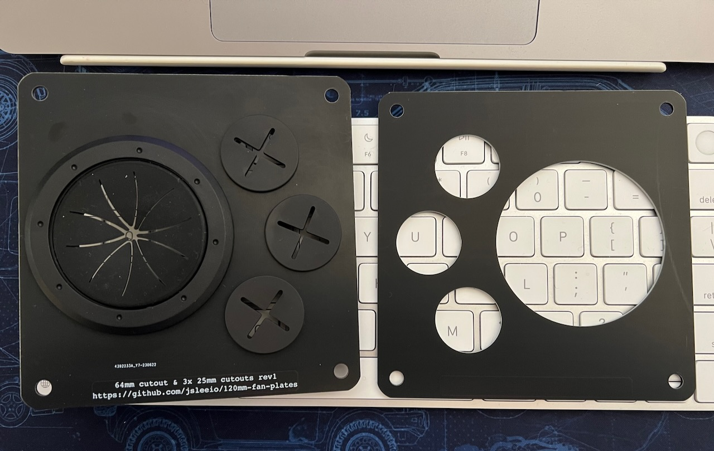

# 120mm fan plates

## what is this?

This repository contains Kicad designs for PCBs designed to mount to a standard
120mm fan bolt pattern.

I needed to run cables into and out of a 19" rack cabinet and this seemed like
the tidiest way: just cut out the circular part of a fan grille, tidy up the
sharp edges and bolt one of these PCBs on instead.

## suitable cable grommets

I found these on Amazon:

* small cutouts: https://www.amazon.com.au/dp/B09L7V6JGR
* large cutout: https://www.amazon.com.au/dp/B096YK52TQ

The grommet for the large cutout will work due to the springs, but the hole is
slightly too large. If you are ordering PCBs, you could safely reduce the
radius of the largest cutout by at least 1mm. Note I haven't actually tried
this.

## other notes

* matte black PCBs look great until you touch them, then fingerprints :-(
* why PCBs? Cheap and fast, and you can order them from many places.  FR4 is
  strong. I used JLCPCB but have previously used Seeed Studio and others with
  no problems.
  * if you use JLCPCB, follow their Gerber generation
    [instructions](https://support.jlcpcb.com/article/194-how-to-generate-gerber-and-drill-files-in-kicad-6)
* you can use Kicad to export a DXF if you want to use some other production
  process
* thicker (than the standard 1.6mm) PCBs are much more bend-resistant, but it
  will likely be a lot cheaper to order more 1.6mm boards and stack them.

